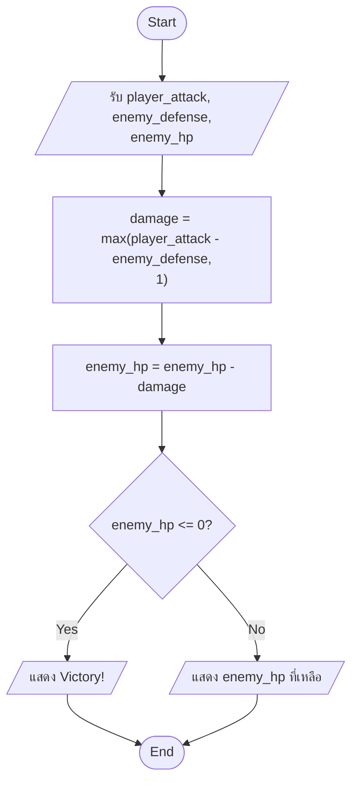
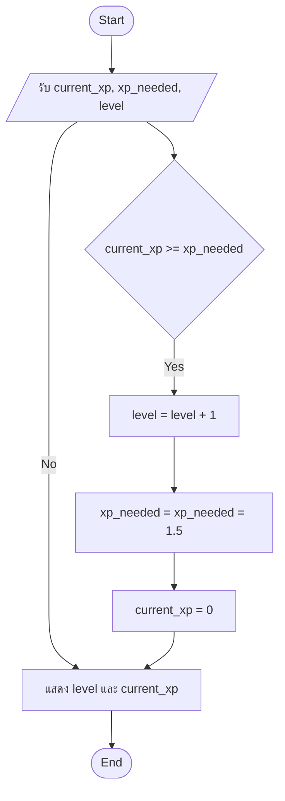

```mermaid

flowchart TD
Start([Start]) --> Input[/รับ player_attack, enemy_defense,
enemy_hp/]
Input --> Calc["damage = max(player_attack - enemy_defense,
1)"]
Calc --> Reduce["enemy_hp = enemy_hp - damage"]
Reduce --> D1{enemy_hp <= 0?}
D1 -->|Yes| Win[/แสดง Victory!/]
D1 -->|No| Show[/แสดง enemy_hp ที่เหลือ/]
Win & Show --> End([End])
```

```mermaid
flowchart TD
Start([Start]) --> I1[/รับ current_xp, xp_needed, level/]
I1 --> D1{current_xp >= xp_needed}
I1 --> |No| P4
D1 --> |Yes| P1[level = level + 1]
P1 --> P2[xp_needed = xp_needed = 1.5]
P2 --> P3[current_xp = 0]
P3 --> P4[แสดง level และ current_xp]
P4 --> End([End])
```
